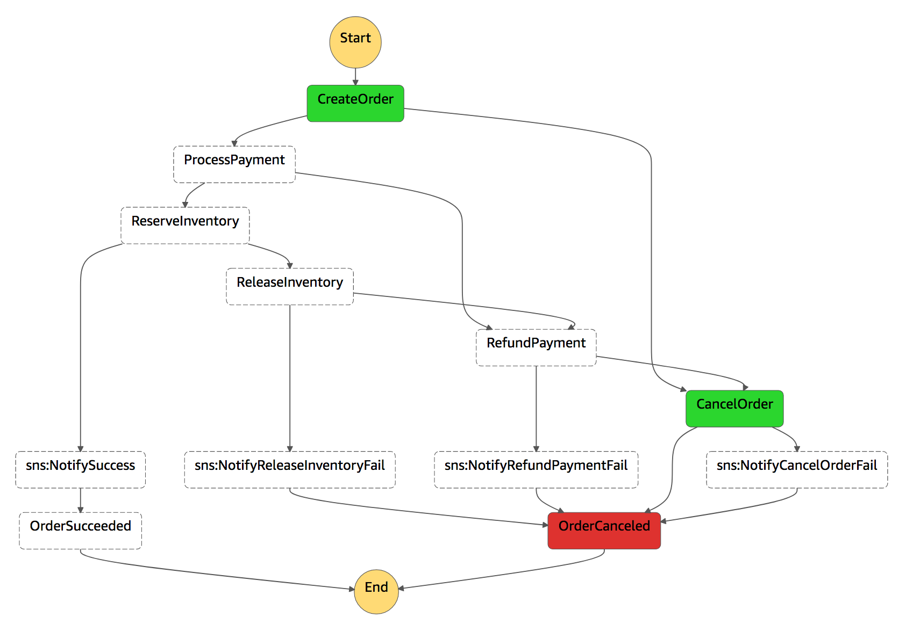
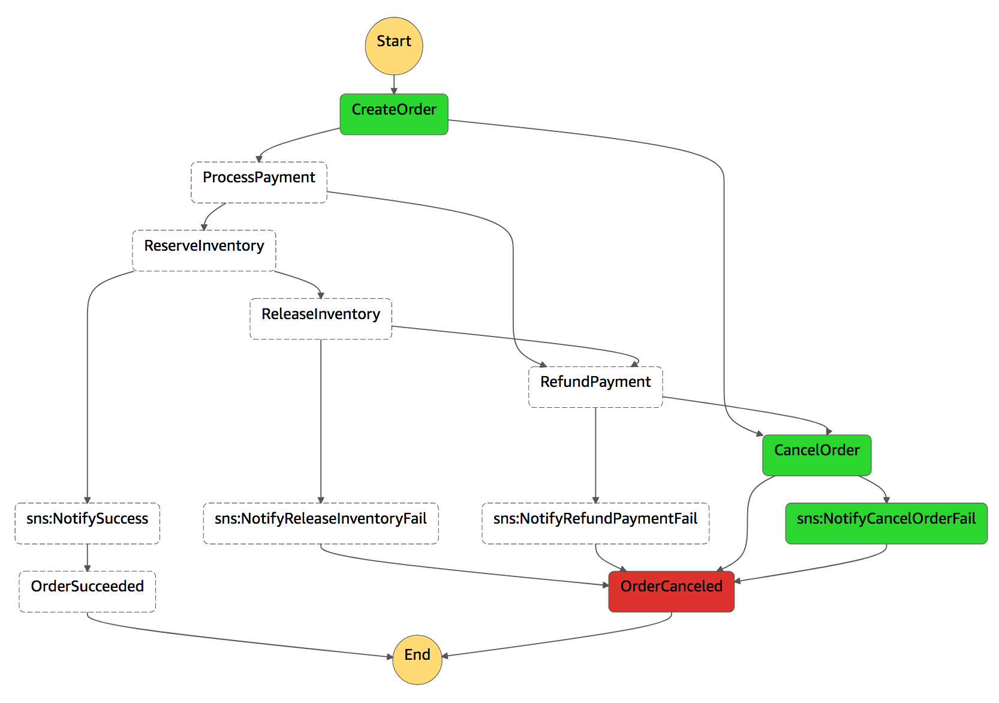
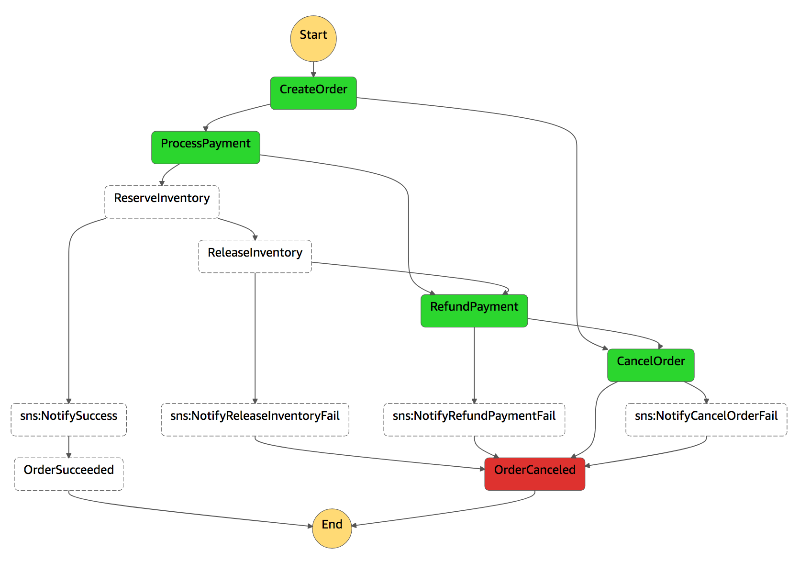
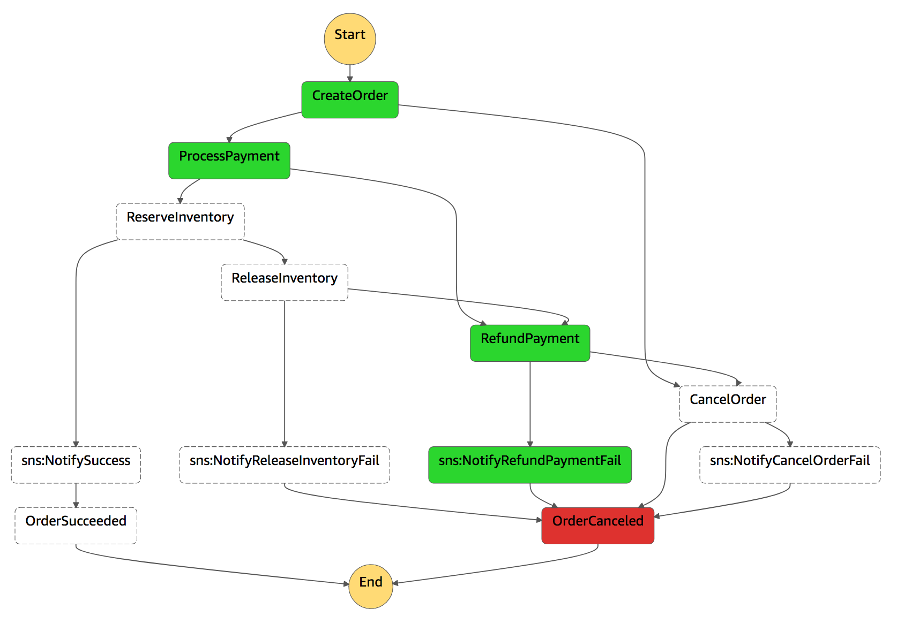
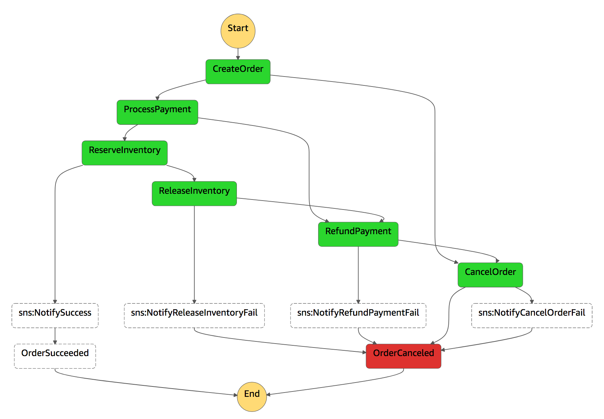
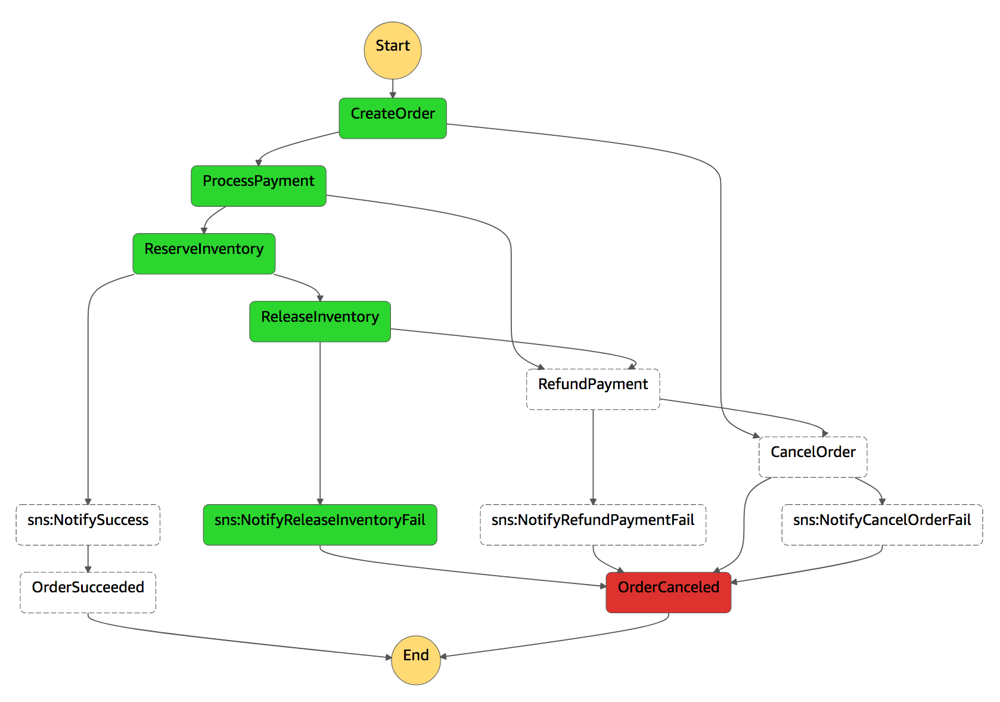
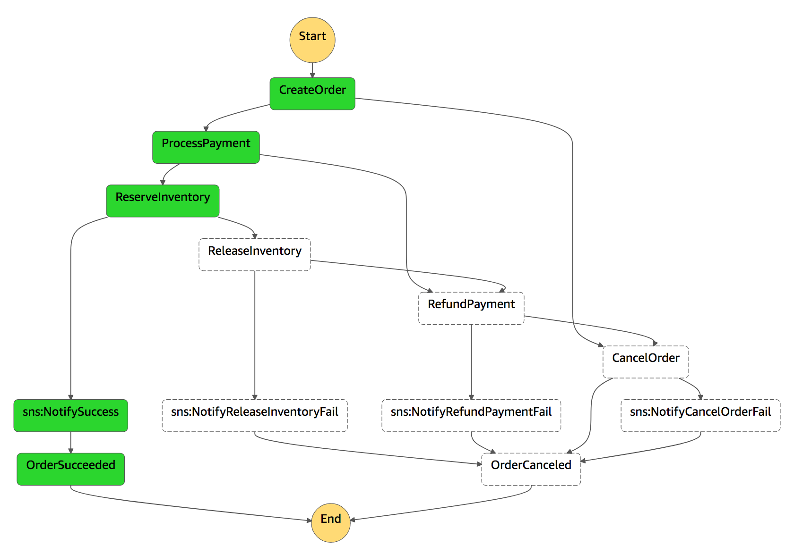

# Session Guide

## What's in this repository?

This is a sample template for Managing Long Lived Transactions with AWS Step Functions. Below is a brief explanation of what we have created for you:

``` bash
.
├── pom.xml                                                     <-- Maven build file to automate the build
├── docs                                                        <-- Workshop guide and setup instructions
│   ├── guide.md
│   └── setup.md
├── models                                                      <-- Models package that defines the types used by the various functions and state data
│   └── src
|       └── main
|           └── java
|               └── com
|                   └── aws
|                       └── sample
|                           └── cmr
|                               └── stepfunctions
│                                   ├── Inventory.java
│                                   ├── InventoryReleaseException.java
│                                   ├── InventoryReservationException.java
│                                   ├── Item.java
│                                   ├── Order.java
│                                   ├── OrderCancelationException.java
│                                   ├── OrderCreationException.java
|                                   └── Payment.java
|                                   └── PaymentProcessException.java
|                                   └── PaymentRefundException.java
├── inventory-reservation
│   └── src
|       └── main
|           └── java
|               └── com
|                   └── aws
|                       └── sample
|                           └── cmr
|                               └── stepfunctions
|                                   └── InventoryReservation.java   <-- Lambda function code represents task to reserve order items from the inventory
├── inventory-release
│   └── src
|       └── main
|           └── java
|               └── com
|                   └── aws
|                       └── sample
|                           └── cmr
|                               └── stepfunctions
|                                   └── InventoryRelease.java   <-- Lambda function code represents compensating transaction to release inventory
├── order-creation
│   └── src
|       └── main
|           └── java
|               └── com
|                   └── aws
|                       └── sample
|                           └── cmr
|                               └── stepfunctions
|                                   └── OrderCreation.java      <-- Lambda function code represents task to create a new order and set status to "new order"
├── order-cancelation
│   └── src
|       └── main
|           └── java
|               └── com
|                   └── aws
|                       └── sample
|                           └── cmr
|                               └── stepfunctions
|                                   └── OrderCancelation.java   <-- Lambda function code represents task to cancel an order
├── payment-processing
│   └── src
|       └── main
|           └── java
|               └── com
|                   └── aws
|                       └── sample
|                           └── cmr
|                               └── stepfunctions
|                                   └── PaymentProcessing.java  <-- Lambda function code represents task to process financial transaction for the order
├── payment-refund
│   └── src
|       └── main
|           └── java
|               └── com
|                   └── aws
|                       └── sample
|                           └── cmr
|                               └── stepfunctions
|                                   └── PaymentRefund.java      <-- Lambda function code represents the compensating transaction to refund customer order
├── state-machine.json                                          <-- Sample saga implementation with Step Functions [USE THIS AS A GUIDE IF YOU GET STUCK]
└── template.yaml                                               <-- SAM template for defining and deploying serverless application resources
```

## Amazon States Language

A full description of the how to describe your state machine can be found on the [Amazon States Language specification](https://states-language.net/spec.html).

Please review the "Templates" section in the [AWS Console](https://console.aws.amazon.com/states/home) for examples of how you can implement various states.

### Useful snippets

#### Task state

The Task State (identified by "Type":"Task") causes the interpreter to execute the work identified by the state's “Resource” field.

```json
"ProcessOrder": {
  "Comment": "First transaction to create the order and set the order status to new",
  "Type": "Task",
  "Resource": "arn:aws:lambda:[REGION]:[ACCOUNT NUMBER]:function:[IDENTIFIER]",
  "TimeoutSeconds": 10,
  "Next": "ProcessPayment"
}
```

#### Catch
Any state can encounter runtime errors. Errors can arise because of state machine definition issues (e.g. the “ResultPath” problem discussed immediately above), task failures (e.g. an exception thrown by a Lambda function) or because of transient issues, such as network partition events.

```json
"Catch": [
  {
    "ErrorEquals": ["OrderCreationException"],
    "ResultPath": "$.error",
    "Next": "CancelOrder"
  }
]
```

#### Retry
Task States and Parallel States MAY have a field named “Retry”, whose value MUST be an array of objects, called Retriers.

When a	state reports an error, the interpreter scans through the Retriers and, when the Error Name appears in the value of of a Retrier’s “ErrorEquals” field, implements the retry policy described in that Retrier.

```json
"Retry": [{
  "ErrorEquals": ["States.ALL"],
  "IntervalSeconds": 1,
  "MaxAttempts": 2,
  "BackoffRate": 2.0
  }],
  "Catch": [{
    "ErrorEquals": ["InventoryReleaseException"],
    "ResultPath": "$.error",
    "Next": "ReleaseInventoryFailed"
  }
]
```

## Custom Errors

The following is a list of all the custom errors thrown by the application and can be used in your state machine.

* `OrderCreationException` represents a process order creation error
* `OrderCancelationException` represents a process order cancellation error
* `PaymentProcessException` represents a process payment error
* `PaymentRefundException` represents a process payment refund error
* `InventoryReservationException` represents a inventory update error
* `InventoryReleaseException` represents a inventory update reversal error

## Testing Scenarios

The AWS Step Functions implementation has been configured for you to be easily test the various scenarios of the saga implementation. Modifying your `order_id` with a specified prefix will trigger an error in the each Task.

OrderID Prefix | Will error with | Example | Expected execution
------------ | ------------- | --- | ---
1 | OrderCreationException | 1ae4501d-ed92-4b27-bf0e-fd978ed45127 |  
11 | OrderCancelationException | 11328abd-368d-43fd-bd4f-db15b5b63951 | 
2 | PaymentProcessException |  20b0b599-441b-45c3-910e-ad63fe992c43 | 
22 | PaymentRefundException | 222f741b-0292-4f93-a2f7-503f92486955 | 
3 | InventoryReservationException | 3a7dc768-6f32-495d-a140-3d330c246f50 | 
33 | InventoryReleaseException | 33a49007-a815-4079-9b9b-e30ae7eca11f | 
4-9 | No error | 47063fe3-56d9-4c51-b91f-71929834ce03 | 

### Invoking your Step Function via CLI

The AWS CLI command will trigger a execution of your state machine. Make sure you substitute the ARN for the state machine in your account. You can find the ARN in the AWS CloudFormation Output section or in the AWS Step Functions console.


> `--region` must match the region you have deployed the application stack into. This is optional if you're using your default region.

``` bash
aws stepfunctions start-execution \
    --state-machine-arn "arn:aws:states:[REGION]:[ACCOUNT NUMBER]:stateMachine:[STATEMACHINE-NAME]" \
    --input "{\"orderId\": \"40063fe3-56d9-4c51-b91f-71929834ce03\", \"orderDate\": \"2018-10-19T10:50:16+08:00\", \"customerId\": \"8d04ea6f-c6b2-4422-8550-839a16f01feb\", \"items\": [{ \"itemId\": \"567\", \"quantity\": 1.0, \"description\": \"Cart item 1\", \"unitPrice\": 199.99 }]}" \
    --region [AWS_REGION]
```

[DOWNLOAD SCENARIO CLI COMMANDS](cli-commands.txt)

## Additional Step Functions Resources

* [AWS Step Functions](https://aws.amazon.com/step-functions/)
* [AWS Step Functions Developer Guide](https://docs.aws.amazon.com/step-functions/latest/dg/welcome.html)
* [AWS Step Function Tutorials](https://docs.aws.amazon.com/step-functions/latest/dg/tutorials.html)
* [statelint](https://github.com/awslabs/statelint)
* [Amazon States Language](https://states-language.net/spec.html)

## How else can you implement this solution?

Is there any other way you can think of how to break this problem down? What other features of Step Functions could be employed to implement a saga pattern?