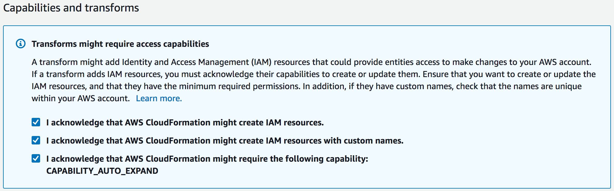

# Setup Information

## Setup Your Development Environment Using AWS CloudFormation

The easiest way to get started is to launch an AWS CloudFormation template that will setup an AWS Cloud9 environment for you:.

Region| Launch
------|-----
EU Central (Frankfurt) | [](https://console.aws.amazon.com/cloudformation/home?region=eu-central-1#/stacks/create/review?stackName=aws-step-functions-workshop&templateURL=https://s3.amazonaws.com/aws-step-functions-workshop/cloud9.yaml)
EU West (Dublin) | [](https://console.aws.amazon.com/cloudformation/home?region=eu-west-1#/stacks/create/review?stackName=aws-step-functions-workshop&templateURL=https://s3.amazonaws.com/aws-step-functions-workshop/cloud9.yaml)

### CloudFormation Setup Instructions

1. Click the **Launch Stack** link above for the region of your choice.

2. Name the stack (or leave the default `cloud9-dev-env`)

3. In the Capabilities section acknowledge that CloudFormation will create IAM resources and click **Create**.
    

4. Select `Create Change Set`

5. Once the Change Set has been successfully created, select `Execute` to create the stack.

6. After the stack was created successfully, open your [AWS Cloud9 console](https://console.aws.amazon.com/cloud9/) and select the newly created IDE by clicking `Open IDE`.

> If you cannot see your IDE, make sure you have selected the same region in the top right corner, as you have chosen above.

## Deploy from Source
After you are connected to your AWS Cloud9 IDE, open a terminal window/tab to deploy our initial version of the e-commerce application:

1. Upgrade to Java 8 and verify it by executing the following commands:

```shell
sudo yum install -y java-1.8.0
sudo yum remove -y java-1.7.0
java -version
```

You should see a similar output like the following:

```shell
openjdk version "1.8.0_201"
OpenJDK Runtime Environment (build 1.8.0_201-b09)
OpenJDK 64-Bit Server VM (build 25.201-b09, mixed mode)
```

2. Add the Apache repository to yum and install the latest version of Apache Maven: 

```shell
sudo wget http://repos.fedorapeople.org/repos/dchen/apache-maven/epel-apache-maven.repo -O /etc/yum.repos.d/epel-apache-maven.repo
sudo sed -i s/\$releasever/7/g /etc/yum.repos.d/epel-apache-maven.repo
sudo yum install -y apache-maven
mvn --version
```

You should see a similar output like the following:

```shell
Apache Maven 3.5.2 (138edd61fd100ec658bfa2d307c43b76940a5d7d; 2017-10-18T07:58:13Z)
Maven home: /usr/share/apache-maven
Java version: 1.8.0_201, vendor: Oracle Corporation
Java home: /usr/lib/jvm/java-1.8.0-openjdk-1.8.0.201.b09-0.43.amzn1.x86_64/jre
Default locale: en_US, platform encoding: UTF-8
OS name: "linux", version: "4.14.114-83.126.amzn1.x86_64", arch: "amd64", family: "unix"
```

3. Clone the workshop source code from GitHub, compile the code and package it by executing: 

```shell
git clone https://github.com/muellerc/aws-step-functions-long-lived-transactions.git
cd aws-step-functions-long-lived-transactions/
mvn clean install
```

You should see a similar output like the following:

```shell
...
[INFO] ------------------------------------------------------------------------
[INFO] BUILD SUCCESS
[INFO] ------------------------------------------------------------------------
[INFO] Total time: 20.772 s
[INFO] Finished at: 2019-06-03T08:58:03Z
[INFO] Final Memory: 16M/55M
[INFO] ------------------------------------------------------------------------
```

4. Create an Amazon S3 bucket where we will upload the build artifacts and the AWS SAM template. In the last step, we deploy the initial e-commerce application which will only take 2 minutes. Run the following commands:

> **Replace BUCKET_NAME, YOUR_AWS_REGION and YOUR_EMAIL_ADDRESS with your concrete values.**

```shell
aws s3 mb s3://BUCKET_NAME --region YOUR_AWS_REGION

sam package \
    --template-file template.yaml \
    --output-template-file packaged.yaml \
    --s3-bucket BUCKET_NAME \
    --region YOUR_AWS_REGION

sam deploy \
    --template-file packaged.yaml \
    --stack-name step-functions-workshop \
    --parameter-overrides EMail=YOUR_EMAIL_ADDRESS \
    --capabilities CAPABILITY_IAM \
    --region YOUR_AWS_REGION
```

> **See [Serverless Application Model (SAM) HOWTO Guide](https://github.com/awslabs/serverless-application-model/blob/master/HOWTO.md) for more details in how to get started.**


## Completion

Once you have successfully deployed the functions, go ahead and start building your saga.

See the [Session Guide](guide.md) for more information.